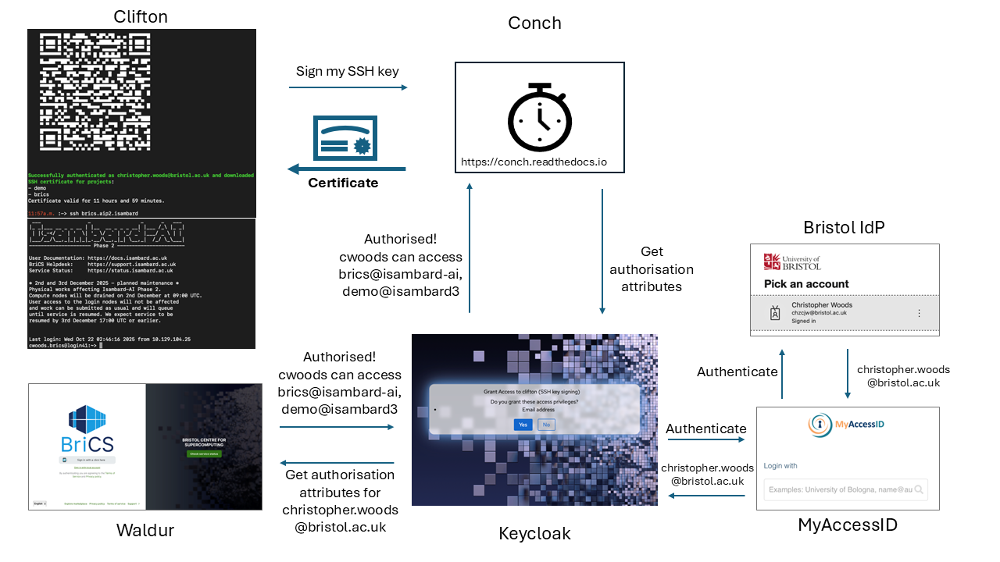
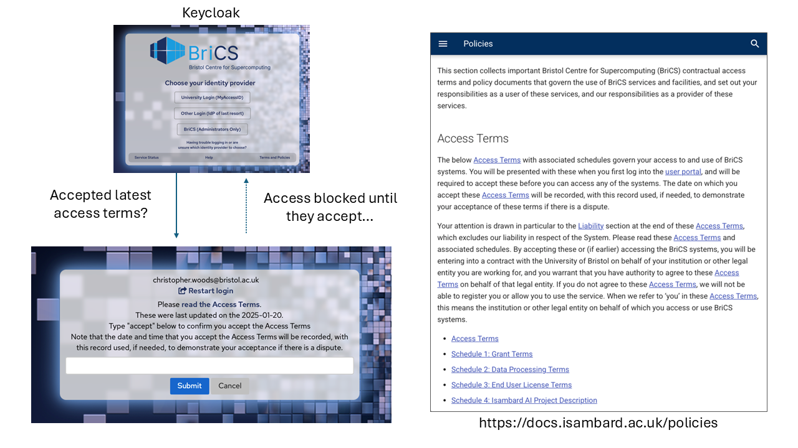
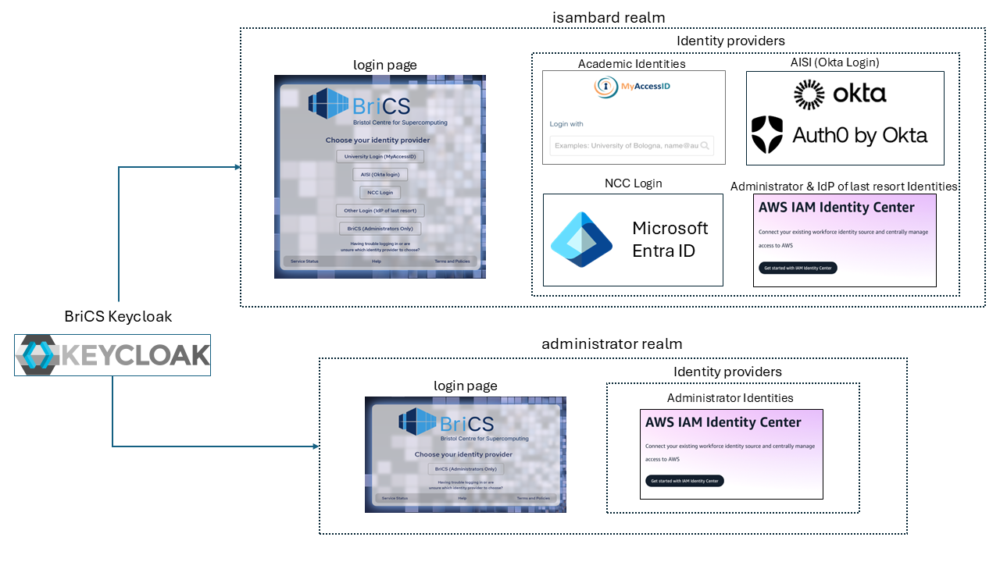
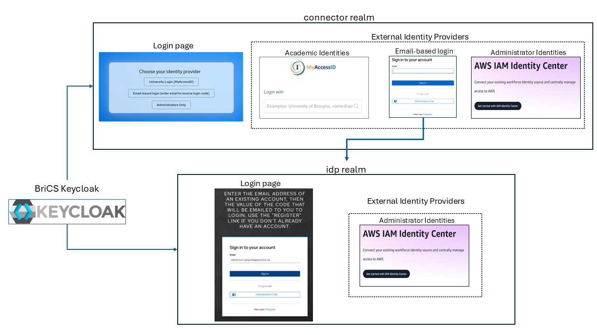
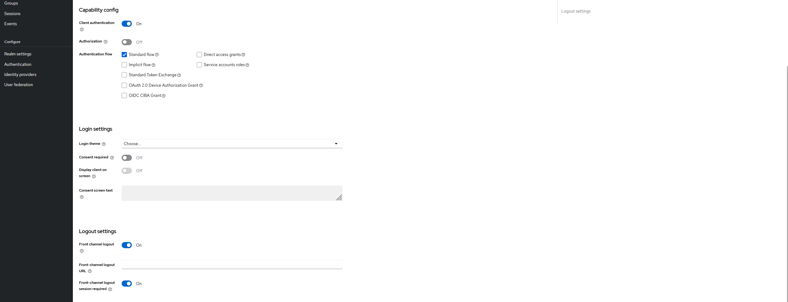
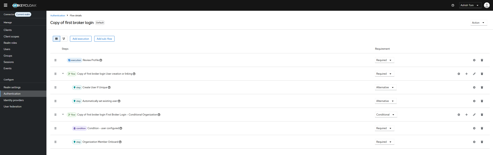

# Federated IAM Using Keycloak and MyAccessID

This guide describes how to connect [Keycloak](https://github.com/keycloak/keycloak), an open-source Identity and Access Management (IAM) solution, with MyAccessID to implement a federated IAM architecture. The examples in this guide are based on implementations from DRI sites that use these tools to provide federated authentication and authorisation.

## Implementing Compliant Authentication and Authorisation with MyAccessID and Keycloak

### Authentication vs Authorisation

Authentication and authorisation serve distinct but complementary purposes:

- **Authentication** verifies *who* a user is.
- **Authorisation** determines *what* an authenticated user is allowed to access.

MyAccessID is used to authenticate a user’s identity, ensuring that the person attempting to log in is who they claim to be.

However, successful authentication alone does not imply that a user is permitted to access a specific service. Keycloak is responsible for authorisation, verifying that the authenticated user has the appropriate permissions to access the requested application or resource.

---

### Authentication with MyAccessID

The diagram above illustrates authentication using MyAccessID as implemented in the [BriCS](https://www.bristol.ac.uk/research/centres/bristol-supercomputing/) Isambard-AI service. In this example, a user attempts to log in to the project management application Waldur.

Keycloak acts as an identity broker between the application and the identity provider, i.e between Waldur and MyAccessID. When the user selects the “University Login (MyAccessID)” option on the Keycloak *Choose your identity provider* page, they are redirected to MyAccessID. MyAccessID then prompts the user to authenticate using their institutional credentials.

In this example, the user’s home institution is the University of Bristol and they login using their institutional account. After successful authentication, MyAccessID sends the user’s identity attributes—such as email address, first name, and last name—back to Keycloak.

---

### Authorisation with Keycloak

At this point, the user has successfully authenticated with Keycloak. The next step is to ensure that the user is authorised to access the requested service.

In this architecture, Waldur is the source of truth for project membership and access rights. Keycloak acts as an authorisation broker, determining whether the authenticated user is permitted to access a given service.

To make this decision, Keycloak queries Waldur using a custom Keycloak plugin, which retrieves the user’s project and facility memberships.

- If the user is authorised, Keycloak allows the login flow to continue and issues the appropriate tokens.
- If the user is not authorised, access is denied and the login attempt fails.

This clear separation of authentication and authorisation using MyAccessID and Keycloak enables a secure, flexible, and policy-driven access control model.

To better illustrate this, consider a DRI operating multiple facilities and services. For example, a user may belong to projects on the BriCS facilities Isambard-AI and Isambard3. BriCS may operate additional facilities, each hosting multiple projects.

When the user logs in, they should be able to access only the projects they are a member of across the facilities they are authorised for. They must not be able to access projects or facilities for which they have no authorisation.

The diagram below illustrates the workflow of a user, `cwoods`, accessing projects on the Isambard-AI and Isambard3 clusters via SSH.

At BriCS, access to facilities is performed using signed SSH certificates. This workflow involves the following components:

- **Keycloak** for authentication and authorisation brokering
- **Waldur** for authoritative project and membership data
- **Conch** as the SSH Certificate Authority (SSH CA)
- **Clifton** as the client-side tool used to request SSH certificates

In short, Clifton manages the lifecycle of SSH certificates issued by Conch. With this context, the typical SSH access flow is as follows. In this example, the user has access to:

- `brics` project on Isambard-AI  
- `demo` project on Isambard3  

#### SSH Access Flow

The SSH authorisation process consists of two distinct phases: an **authorisation request** and an **authorisation response**. The diagrams below illustrate the end-to-end flow.

##### Authorisation Request Path (User → Keycloak → Waldur)

This diagram shows how an SSH authorisation request propagates from the user, through Keycloak, to Waldur.

1. The user requests an SSH certificate from **Clifton** in order to access BriCS facilities.
2. Clifton, which is registered as an OIDC client in Keycloak, initiates an authorisation request via **Conch**, the SSH Certificate Authority.
3. Conch redirects the user to **Keycloak** to determine which facilities and projects the user is authorised to access.
4. The user authenticates using **MyAccessID** using their institutional identity.
5. Keycloak queries **Waldur**, via a [custom plugin](https://github.com/isambard-sc/keycloakplugins/tree/main/keycloak-isambard-auth-plugin), to retrieve the user’s project memberships.

---

##### Authorisation Response Path (Waldur → Keycloak → User)

This diagram shows how the authorisation decision is returned from Waldur, via Keycloak, back to the user.

1. **Waldur** responds to Keycloak's request with the list of projects and facilities the user is authorised to access.
2. **Keycloak** presents an authorisation prompt to the user. Upon approval, the authorisation context is returned to Conch.
3. **Conch** signs the user’s SSH public key and returns the signed certificate.
4. **Clifton** receives the signed certificate, and the user can access the authorised projects via SSH.

### Connecting Keycloak to MyAccessID

Follow the guidance provided in the official [MyAccessID documentation for connecting Keycloak](https://wiki.geant.org/spaces/MyAccessID/pages/867205135/Connecting+a+Keycloak+RP) to configure Keycloak for integration with MyAccessID.

The section below highlights configuration settings that are not explicitly covered in the official documentation, but are included here as a reference from the current configuration at BriCS.

The **Trust Email** option is enabled because the email address provided by MyAccessID is verified. Users authenticate to MyAccessID using their institutional credentials, and the email attribute returned is associated with that verified institutional identity.

Keycloak is configured to automatically create user accounts the first time a user logs in via MyAccessID. To enable this behaviour, set the **First Login Flow Override** to `Auto Create and Link Account`. **Post Login Flow** is configured as `Waldur Check Access`. This enables Keycloak to evaluate whether an authenticated user is authorised to access services based on information retrieved from Waldur. In addition, the flow enforces compliance by ensuring that the user has accepted the latest Access Terms, Acceptable Use Policy, and Data Privacy Policy. These aspects are described in more detail in the section covering Authentication Flows.

**Sync Mode** is set to `Force`so that the attributes received from MyAccessID are always updated in the user account using the attribute mappers discussed below.

#### Attributes, Claims, and Scopes

The configuration of attributes, claims, and scopes may vary between DRI sites depending on local requirements.

For example, at BriCS, the attributes of interest are:

- Email address  
- First name  
- Last name  
- Community User Identifier  

To request these attributes from MyAccessID, the **Scopes** field under the advanced settings is configured as:

`openid profile email`

The corresponding **mappers** are configured in Keycloak to consume and map these attributes into the user account, as shown above.

Additionally, users authenticating via MyAccessID are configured to be automatically assigned to a dedicated Keycloak group using the **ForceMyAccessIDGroup Mapper**. This grouping simplifies management and policy enforcement for users who log in through MyAccessID.

#### Authentication Flows

[Authentication flows](https://www.keycloak.org/docs/latest/server_admin/index.html#_authentication-flows) are configurable sequences of steps that determine how a user is authenticated and processed during login. In this context, the following flows are used:

1. **`Auto Create and Link Account`**

   This flow uses two built-in executions, as shown below.

   

   After authentication, a Keycloak user account is created if one does not already exist. If an account already exists, it is reused.

2. **`Waldur Check Access`**

   This flow uses two custom Keycloak plugins to support authorisation and compliance, as shown below.

   

   The source code for the Java plugins implementing these executions is available on [GitHub](https://github.com/isambard-sc/keycloakplugins/tree/main).  The **auth-plugin** is responsible for querying Waldur for project membership. Once the user is authenticated, the plugin uses the user’s email address to query Waldur and retrieve project membership information. The user is only permitted to log in if they are a member of at least one project.

   After this check, the **tandc-plugin** ensures that the user has accepted the latest Access Terms, Acceptable Use Policy, and Data Privacy Policy.
   
   Once these conditions are satisfied, authorisation is complete and the user is granted access to the requested service.

To support these flows, the Keycloak **User Profile** is extended to store additional information.

As shown above, the realm’s User Profile includes additional fields such as `projects`, which record the projects the user is authorised to access, as well as fields that capture policy acceptance state: `tandc_accepted`, `dpriv_accepted`, and `ause_accepted`. The `short_name` field is used by Clifton to support SSH access.

#### Realms

Keycloak is a multi-tenant system in which realms are used to separate different tenants. Each tenant can have its own independent set of users, groups, roles, clients and identity providers.

Out of the box, Keycloak includes a privileged **`master` realm**, which is used to manage the Keycloak server itself, for example, to create and administer other realms. Due to its elevated privileges, this realm is tightly restricted and is used only for operations that require high-level administrative access.

In the BriCS implementation, the following additional realms are used:

1. **Isambard Realm**

   The `isambard` realm is the primary realm used for BriCS services. It is used by user-facing BriCS services to authenticate both standard users and administrators.

2. **Administrators Realm**

   This realm is used for internal BriCS services that are accessed exclusively by the BriCS team.

### Supporting Users Without MyAccessID Institutional Access

As the service evolves, there is a need to support users whose institutions are not part of MyAccessID(eduGAIN). In the current BriCS deployment, several approaches are used to accommodate these users.

The figure above shows the identity providers currently linked to the BriCS Keycloak instance. Depending on their affiliation, users select the appropriate option from the list to log in.

1. **University Login (MyAccessID)**

   Uses the MyAccessID integration described earlier and allows users whose institutions participate in MyAccessID to log in using their institutional credentials.

2. **AISI (Okta Login)**

   As [AISI](https://www.aisi.gov.uk/) is a significant user of BriCS services, its Okta identity platform is configured as an external identity provider. This allows AISI users to log in using their existing Okta identities.

3. **NCC Login**

   Used by [NCC](https://www.nccuk.com/) users to log in with their Microsoft Entra ID accounts.

4. **Other Login (IdP of Last Resort)**

   This option is used for users who are not part of MyAccessID or the institutions listed above. These users authenticate using identities that are manually created in AWS IAM Identity Center.

5. **BriCS (Administrators Only)**

   Used exclusively by BriCS service administrators. This option also relies on identities managed in AWS IAM Identity Center.

If there is a sufficient number of users from an organisation, it can be beneficial to support that organisation's identity provider directly if it is not currently part of MyAccessID, as is the case for AISI and ncc.

For organisations that are not part of MyAccessID, user identities must currently be created and managed manually in AWS. As the range of services offered by BriCS grows and the user base expands to include small and medium-sized organisations that are not part of MyAccessID, this approach becomes increasingly difficult to scale. Additionally, there may be situations where the MyAccessID service is unavailable, in which case users who rely on it for authentication would be unable to log in.

One possible approach to address these challenges is to use an email-based authenticator, as is currently implemented in [AIRRPortal](https://portal-airr.isambard.ac.uk/login/).

#### AIRRPortal

AIRRPortal is the platform through which users apply for access to [AI Research Resources](https://www.gov.uk/government/publications/ai-research-resource). Users authenticate to AIRRPortal using Keycloak and ease of access to the platform is an important consideration.

As shown in the image above, AIRRPortal supports University Login using MyAccessID. Administrators authenticate using identities from AWS IAM Identity Center, which is configured as an external identity provider (IdP) in Keycloak. For users who cannot use MyAccessID, an email-based login option is also available.

The email-based login verifies a user’s identity by confirming control of an email address. During authentication, Keycloak sends a one-time code or link to the user’s email address, which the user must present to complete the login process.

When a user logs in using the email authenticator for the first time, a Keycloak account is automatically created as part of the authentication flow. Initial registration uses a dedicated mechanism in which the user’s email address is verified via a magic link. Once the user accesses the link sent to their email, authentication is completed and the user is logged in to AIRRPortal.

Subsequent logins use a simplified flow using a one-time code sent to the user's email address.

As shown above, the user supplies the email address previously registered with the email authenticator and verifies their identity using the one-time code sent to their email.

##### Configuring Realms

For AIRRPortal logins, two additional realms are configured in Keycloak:

1. `connector` realm

   This realm is used for standard users logging in via MyAccessID and email-based logins, as well as for administrators authenticating using identities from AWS IAM Identity Center. Because this realm resides within the same Keycloak instance operated by BriCS, the existing MyAccessID connection configured for the `isambard` realm is reused.

   By default, users are directed to the login page for the Connector realm when accessing AIRRPortal. From there, depending on whether they can use MyAccessID, they choose either University Login using MyAccessID or the email-based login option.

2. `idp` realm

   This realm is dedicated to the email-based authenticator. It uses the [magic link plugin](https://github.com/p2-inc/keycloak-magic-link) to allow users to authenticate using a code sent to their email address when they log in through this realm. An OIDC client configured in this realm is set up as an identity provider in the `connector` realm, so that users are redirected here when selecting the email-based login option.

###### Setting up the `idp` realm

The realm is configured to allow users to register and log in using their email address.

As shown in the realm settings, `User registration` is enabled. `Login with email` is turned on, with `Email as username` and `Verify email` enabled.

The built-in browser-based authentication flow is modified as follows:

This is created from a copy of the default browser flow is created. This is then edited as shown above, and set as the default using the `actions` menu in the top-right of the window.

An OIDC client is configured in this realm so that the `connector` realm can use it as an identity provider.

The Root URL and Home URL are configured as shown. Web Origins is set to allow all origins.

The remaining client settings are shown below:

`Client authentication` is enabled, as this is not a public client and requires a pre-shared client secret. `Front-channel logout` is also enabled.

###### Setting up the connector realm

An identity provider is configured in the `connector` realm using the details of the client defined in the `idp` realm.

The previously configured `Client ID` and the `Client Secret` generated for the client in the IdP realm are used here.

Advanced settings are configured as shown below:

`Trust Email` is enabled, as the email address returned by the IdP realm has already been verified. `First Login Flow Override` is set to use a modified authentication flow, shown below.

A copy of the default flow is created, edited as shown above, and set as the default using the `actions` menu in the top-left of the window.
